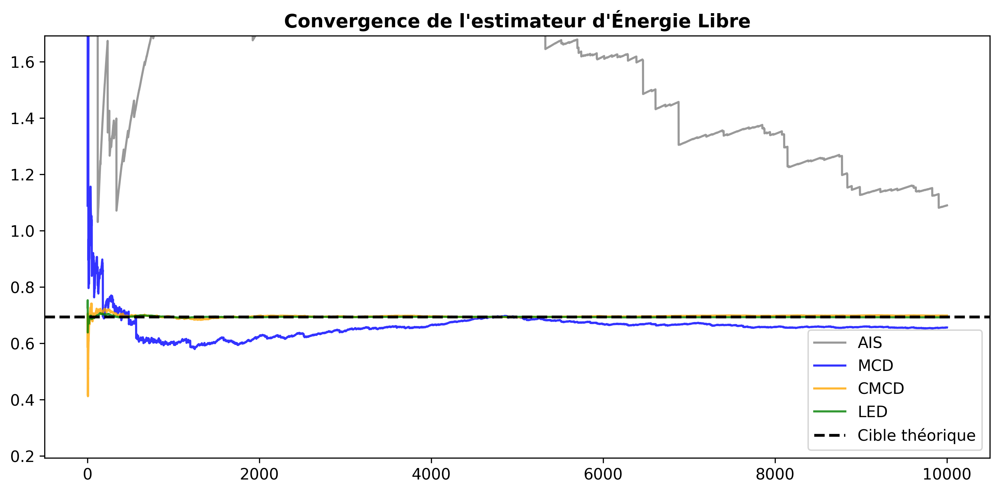
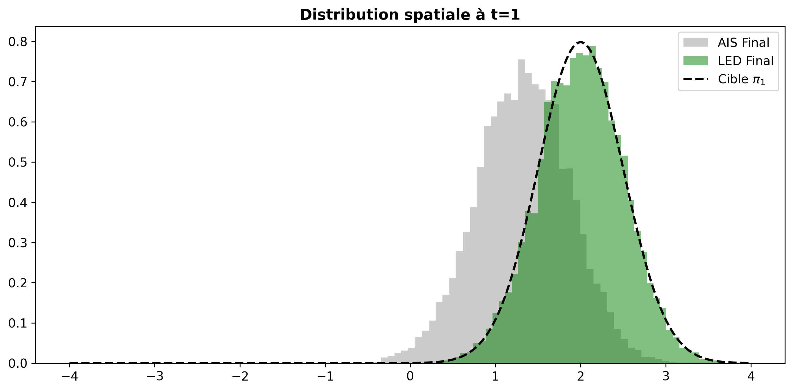
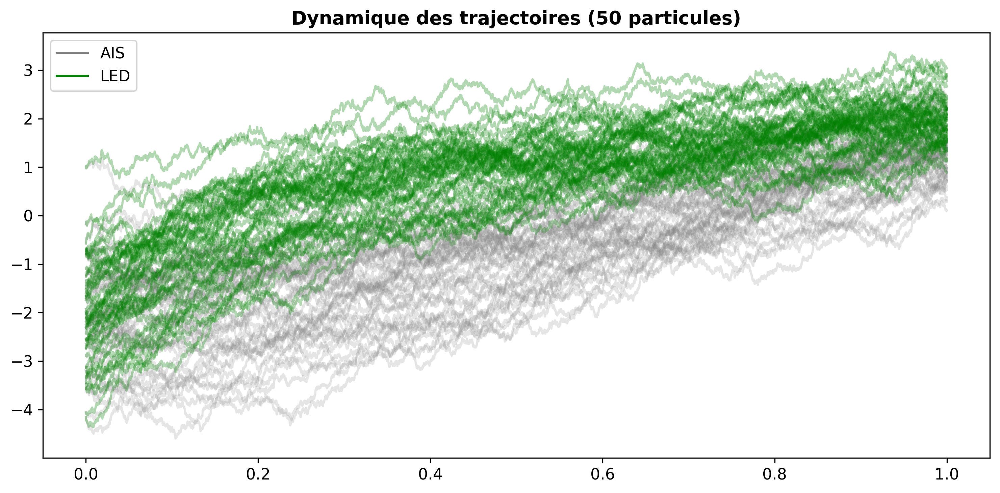

# Free Energy Estimation via Non-Equilibrium Langevin Dynamics

**Projet de département IMI — École des Ponts ParisTech (2025–2026)**  
**Étudiant :** Idris Rayane Mjidi | **Tuteur :** Régis Santet

Implémentation et comparaison de quatre algorithmes d'estimation de différences d'énergie libre
entre deux distributions de Mélanges Gaussiens (GMM), basée sur le Chapitre 5 de la thèse de
[Régis Santet (ENPC, 2024)](https://pastel.hal.science/tel-04634665).

---

## Le problème

Soient $\pi_0$ et $\pi_1$ deux distributions de probabilité sur $\mathbb{R}^d$.
On cherche à estimer le **rapport de partition** :

$$\frac{Z_1}{Z_0} = e^{-\Delta F}$$

Par l'**égalité de Jarzynski (1997)** :

$$\mathbb{E}\bigl[e^{-W}\bigr] = \frac{Z_1}{Z_0}$$

où $W$ est le travail virtuel accumulé le long d'une trajectoire de Langevin hors-équilibre
reliant $\pi_0$ à $\pi_1$.

La dynamique d'Euler-Maruyama discretise la SDE de Langevin :

$$q_{k+1} = q_k - \delta t \,\nabla V_{\lambda_{k+1}}(q_k) + \sqrt{2\,\delta t}\, G_k,
\qquad G_k \sim \mathcal{N}(0, I)$$

le long du chemin géométrique $\pi_\lambda(q) \propto \pi_0(q)^{1-\lambda} \pi_1(q)^\lambda$.

---

## Les quatre algorithmes

| Algorithme | Idée clé | Paramètres appris |
|---|---|---|
| **AIS** | Estimateur de Jarzynski standard, pas d'apprentissage | — |
| **MCD** | Apprend le noyau backward $B^\theta_k$ via un réseau de score $s_\theta \approx \nabla \log p_k$ | $s_\theta$ |
| **CMCD** | Apprend un drift forward $u_\theta$, backward = time-reversal exact (sans score) | $u_\theta$ |
| **LED** | Minimise $\mathrm{Var}(W^\theta)$ via la formule continue incluant $\nabla \cdot u_\theta$ | $u_\theta$ |

---

## Résultats (cas 1D de référence)

$\pi_0 = \mathcal{N}(-2, 1)$, $\pi_1 = \mathcal{N}(2, 0.25)$, référence analytique $Z_1/Z_0 = 0.5$ ($\Delta F = \ln 2 \approx 0.693$).  
$N = 10\,000$ trajectoires, $\delta t_{\text{eval}} = 10^{-4}$.

| Algorithme | $\hat{r}$ | $\widehat{\Delta F}$ | $\text{Var}(e^{-W})$ | Réduction de variance |
|---|---|---|---|---|
| AIS  | 0.336 | 1.090 | $2.81 \times 10^{1}$ | $1\times$ |
| MCD  | 0.519 | 0.657 | $8.01 \times 10^{-1}$ | **35×** |
| CMCD | 0.497 | 0.699 | $2.86 \times 10^{-2}$ | **983×** |
| LED  | 0.500 | 0.692 | $2.95 \times 10^{-3}$ | **9 520×** |

### Convergence de l'estimateur



### Distribution spatiale à $t = T$



### Trajectoires (AIS vs LED)



---

## Structure du dépôt

```
free-energy-gmm/
├── src/
│   ├── physics.py        — GMMParams, PipelineConfig, make_jax_potential
│   ├── algorithms.py     — AIS, MCD, CMCD, LED (train + eval intégrés)
│   └── main.py           — Point d'entrée, métriques, figures
├── archive/
│   ├── src/              — Version modulaire initiale (gmm_*.py, 11 fichiers)
│   └── README.md         — Description de l'ancienne architecture
├── assets/               — Figures de résultats
├── results/              — Tableaux numériques (.txt)
├── requirements.txt
└── .gitignore
```

### Description des fichiers principaux

**`src/physics.py`**  
Contient `GMMParams` (description d'un GMM : means, covs, weights) et `PipelineConfig`
(tous les hyperparamètres : `dt_train`, `dt_eval`, `n_epochs`, `lr_init`, etc.).
La fonction `make_jax_potential` retourne les 5 fonctions d'énergie JAX compilées (`V`, `grad_V`, `dV_dlam`, `log_g0`, `log_g1`).
**Point critique** : `log_g0` et `log_g1` retournent des densités **non normalisées** —
inclure les constantes de normalisation $-\frac{d}{2}\log(2\pi) - \frac{1}{2}\log|\Sigma|$ 
ferait converger l'estimateur vers 1 au lieu de $Z_1/Z_0$.

**`src/algorithms.py`**  
Quatre algorithmes partageant :
- `build_score_network` : réseau ResNet (2 blocs résiduels, Softplus, embedding temporel appris, warm-start `scale=0`)
- `_train_loop` : Adam + warmup cosine decay + early stopping + gradient clipping
- `_batched_eval` : évaluation en mini-batches avec extraction des trajectoires complètes

Chaque algorithme expose une fonction `train_and_eval_X(cfg)` retournant `(works, trajs), loss_history`.

**`src/main.py`**  
Point d'entrée. Configure les GMMs, lance les quatre algorithmes, calcule les métriques
et génère 5 figures sauvegardées dans un dossier `runs/run_<timestamp>/`.

---

## Installation

```bash
git clone https://github.com/mir012005/free-energy-gmm.git
cd free-energy-gmm
pip install -r requirements.txt
```

## Utilisation

```bash
python src/main.py
```

Les résultats sont sauvegardés automatiquement dans `runs/run_<YYYY-MM-DD_HHhMMmSS>/` :
- `fig1_histogrammes_W.png` — distributions des travaux
- `fig2_trajectoires.png` — faisceaux de trajectoires
- `fig3_densite_finale.png` — distribution spatiale à $t=T$
- `fig4_convergence.png` — convergence de l'estimateur
- `fig5_loss_evolution.png` — courbes d'entraînement
- `resultats_experience.txt` — tableau numérique complet
- `configuration.txt` — hyperparamètres du run

## Configuration rapide

```python
from physics import GMMParams, PipelineConfig
import dataclasses

gmm0 = GMMParams.single_gaussian(mean=[-2.0], cov=[[1.0]])
gmm1 = GMMParams.single_gaussian(mean=[ 2.0], cov=[[0.25]])

cfg_base = PipelineConfig(
    gmm0=gmm0, gmm1=gmm1,
    T=1.0, seed=42, n_samples=10000,
    dt_train=1e-3, dt_eval=1e-4,
    batch_size_train=128, emb_dim=20,
    lr_init=5e-3, n_epochs=5000
)

# Surcharger les epochs par algorithme
configs = {
    "AIS":  cfg_base,
    "MCD":  dataclasses.replace(cfg_base, n_epochs=5000),
    "CMCD": dataclasses.replace(cfg_base, n_epochs=5000),
    "LED":  dataclasses.replace(cfg_base, n_epochs=500),
}
```

---

## Détails d'implémentation

### Séparation entraînement / évaluation

Le réseau est entraîné avec `dt_train = 1e-3` ($K_\text{train} = 1000$ steps) pour limiter
l'usage mémoire. L'évaluation utilise `dt_eval = 1e-4` ($K_\text{eval} = 10\,000$ steps)
pour plus de précision. Le mapping d'index embedding est :

$$k_\text{train} = \left\lfloor k_\text{eval} \cdot \frac{\delta t_\text{eval}}{\delta t_\text{train}} \right\rfloor$$

### Noyaux MCD (eq. 5.24 / 5.26)

$$F_{k+1}(q'|q) = \mathcal{N}\!\left(q - \delta t\,\nabla V_{\lambda_{k+1}}(q),\; 2\delta t\, I\right)$$

$$B^\theta_k(q|q') = \mathcal{N}\!\left(q' + \delta t\,\nabla V_{\lambda_{k+1}}(q') + 2\delta t\, s_\theta(q', k),\; 2\delta t\, I\right)$$

### Noyaux CMCD (eq. 5.10 / 5.28)

$$F^\theta_{k+1}(q'|q) = \mathcal{N}\!\left(q - \delta t\,\nabla V_{\lambda_{k+1}}(q) + \delta t\,\Lambda' u_\theta(q, k),\; 2\delta t\, I\right)$$

$$B^\theta_k(q|q') = \mathcal{N}\!\left(q' - \delta t\,\nabla V_{\lambda_k}(q') + \delta t\,\Lambda' u_\theta(q', \max(k{-}1,0)),\; 2\delta t\, I\right)$$

### Formule de travail LED (eq. 5.11)

$$W^\theta = \int_0^T \Lambda'(s)\left[\frac{\partial V}{\partial \lambda}(q_s) + u_\theta(q_s) \cdot \nabla V(q_s) - \nabla \cdot u_\theta(q_s)\right] ds$$

La divergence $\nabla \cdot u_\theta$ est calculée par `jax.jacfwd` (exact, $O(d)$ passes).

---

## Références

- **Santet, R. (2024)**. *Foundations and Optimization of Langevin Samplers*. Thèse de doctorat, École des Ponts ParisTech. [HAL](https://pastel.hal.science/tel-04634665)
- **Jarzynski, C. (1997)**. Nonequilibrium equality for free energy differences. *Physical Review Letters*, 78(14), 2690.
- **Neal, R. (2001)**. Annealed importance sampling. *Statistics and Computing*, 11(2), 125–139.
- **Doucet, A. et al. (2022)**. Annealed importance sampling meets score matching. *NeurIPS 2022*.
- **Vargas, F. et al. (2023)**. Denoising diffusion samplers. *ICLR 2023*.
